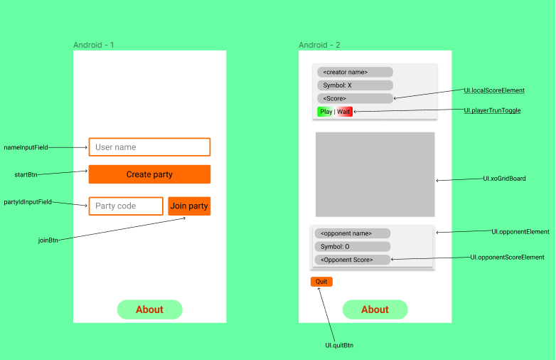

# Multiplayer tictactoe

## UI



## Communication

The way info are exchanged between players can be called _peer to peer_
because the game uses no server it only uses an MQTT broker that routes messages to the opponent and back to the player
(MQTT is lightweigth pubsub protocol and u can think of it as WS with extra characteristics).

Both party players are MQTT clients using **mqttjs library**,
they **subscribe** to the same topic `tictactoe/<partyId>/#` and `partyID = party_creator_user_name + timestamp_of_party_creation`.
when it comes to **publishing** each player replaces the widecard **#** with his _username_ `tictactoe/<partyId>/<username>`.

### handshake

The first "hi" message recieved with an unknown _username_ will be evaluated as a handshake and the _sender username_ will be locked as an _opponent username_

## Security & integrity

Anyone with some frontend dev background or minimum MQTT knowledge can crack the game and manipulate the party flow as he likes and it's inevitable:

-   There might be party intruders because **test.mosquitto.org** offers no way for setting ACL (which would've allowed locking the communication between two and only two mqtt clients using their mqtt clientId)

-   The app infrastructure uses no server and players browsers are the only source of truth

**Example** : using the console, a player can instantiate his game instance which overrides the original instance's UI

```js
const gameCrack = new Game(board);
```

Then he may continue manipulating `gameCrack` propeties.

=> Well we have minus one problem according to this [stackoveflow answer](https://stackoverflow.com/a/33335971/11083033)

The impact of these actions on the opponent side isn't measured
